# Ukážka


# Problém obchodného cestujúceho

## Úvod

Zadaním tohto projektu je implementovať rôzne optimalizačné algoritmy, ktoré nám umožnia nájsť dostatočne dobrú permutáciu navštívenia všetkých zadaných miest na vstupe. Cieľom je navštíviť všetky mestá iba raz a nakoniec sa vrátiť do mesta, z ktorého vychádza. Pomocou algoritmov určených na hľadanie tejto cesty sa snažíme nájsť najkratšiu možnú uzavretú krivku, po ktorej by obchodný cestujúci mohol ísť. Počas vývoja algoritmov, taktiež porovnávame využité súčasti a techniky potrebné na správne fungovanie a vrátenie výsledku. Výsledok bude pozostávať z jednotlivých navštívených miest a finálnej sume vzdialeností.

Hlavnou podstatou tejto práce je implementácia nasledujúcich algoritmov:

- Genetický algoritmus → **GA**
- Simulované žíhanie → **SA**
- Zakázané prehľadávanie → **TABU**

Program sa skladá z mainu, kde sa spúšťa a číta na vstupe zadanú mapu zo súboru. Následne volá podľa zadania používateľa jednotlivé algoritmy a vypisuje riešenie.

1. Načítanie vstupu a výber algoritmu
2. Hľadanie cesty
3. Výpis riešenia

## Implementačné prostredie

Program predstavuje konzolovú aplikáciu, ktorá bola vytvorená v programovacom jazyku **Python v3.8.5 64bit**. Spúšťa sa cez Command Line, PowerShell alebo iný CLI nástroj. Počas celého vykonania programu používame nasledujúce importované moduly:

- [random](https://docs.python.org/3/library/random.html)
    - Náhodné generovanie celého alebo desatinného čísla z rozsahu
- [timeit](https://docs.python.org/2/library/timeit.html)
    - Meranie času vykonávania algoritmov
- [math](https://docs.python.org/3/library/math.html)
    - matematické funkcie pre simulované žíhanie
- [futures](https://docs.python.org/3/library/concurrent.futures.html)
    - multiprocessing na spúšťanie všetkých algoritmov naraz.

Vlastné moduly;

- utils
    - čítanie vstupu, reprezentácia mesta, výpočet fitness a výpis riešenia

## Reprezentácia údajov

Všetky mestá majú svoje súradnice v 2D priestore. Vstupná mapa a rozloženie miest je načítaná zo vstupného súboru na začiatku. Použijeme jednoduchú triedu City, ktorá má dve atribúty a to x a y.


Všetky algoritmy používajú na svoju realizáciu jednotlivé funkcie a atribúty, ktorých fungovanie si vysvetlíme pri každom zvlášť. Skoro pri všetkých je použitá určitá trieda na reprezentovanie jednej permutácie miest.

Genetický algoritmus, - trieda Jedinec.

Simulované žíhanie, - trieda Stav.

Takéto rozdelenie je hlavne kvôli tomu, že ku každej permutácií prislúcha jej cena, čiže vzdialenosť od začiatku do konca. Pri týchto dvoch algoritmoch sa oplatí vykonať tento výpočet okamžite – pri vygenerovaní nového stavu. Pri Tabu Search to nie je potrebné a počítame cenu, až keď potrebujeme.

## Výpočet ceny – vzdialenosti – fitness

Cena cesty medzi dvoma mestami prislúcha Euklidovej vzdialenosti

Počítame ju pomocou vzorca 

```python
sqrt(pow(x2-x1),pow(y2-y1)
```

kde x a y sú súradnice miest. Z *utils* funkcia 

```python
euclidian_d(a, b) *returns* distance : float
```

Túto funkciu voláme, pre každé dve mestá v permutácií a celkovú fitness vypočíta funkcia

```python
fitness(stav) returns cena : round(int)
```

Tento výsledok na základe všeobecnej normy[2] zaokrúhľujeme k najbližšiemu celému číslu.

Keďže hľadáme najkratšiu cestu, tak pre logické fungovanie a prehľadnosť, je vhodné udržiavať si

**prevrátenú hodnotu** dĺžky celej cesty. Inak povedané, ak výsledok z funkcii vyššie umocníme na mínus  dostaneme číslo, ktoré je čím vyššie, tým lepšie *1/cena* a teda lacnejšia cena.

## Metódy a opis použitých algoritmov

Aplikovali sme tri rôzne **optimalizačné algoritmy** na hľadanie, čo najkratšej cesty. Všetky algoritmy sú reprezentované ako samostatné triedy so svojimi metódami a atribútmi. Na to aby sme mohli, z každého z nich vrátiť riešenie ako postupnosť krokov a uchovať potrebné dáta pre výpis, dedia od nadradeného objektu List. Vstupom do týchto algoritmov sú konkrétne **parametre**, ktoré úzko súvisia s riešeným problémom a častokrát sa môžu prispôsobiť pri zmene počtu miest alebo ich rozloženiu.

Algoritmy sa môžu vykonávať neobmedzene dlho, preto je potrebné si zadefinovať **vypínaciu podmienku**. Jedna možnosť je počet iterácií alebo druhá, dĺžka vykonávania. V našom programe je táto podmienka súčasťou spoločných parametrov pre všetky algoritmy.

### Genetický algoritmus

Genetický algoritmu sa snaží priblížiť podobe evolučného vývinu a používa proces naturálnej selekcie na prežitie najlepších jedincov. Spolieha sa biologicky inšpirované operácie ako mutácia, kríženie.

**Gény** sú mestá na mape.

**Chromozóm** teda Jedinec je jedna permutácia miest so svojou fitness.

Hlavná myšlienka a pseudo blokový návrh:

1. Inicializácia prvej generácie
2. Kríženie
3. Mutácia
4. Nová krv
5. Prirodzený výber
6. Opakuj od kroku 2.

Parametre pre GA:

- Veľkosť Generácie
- Počet krížení
- Maximálny počet mutácií
- Veľkosť náhodnej novej krvi vloženej do populácie
- Pravdepodobnosť mutácie
- Metóda výberu rodičov

### Inicializácia prvej a tvorba novej generácie

**Prvá generácia**

Pozostáva z vygenerovania náhodnej permutácie miest. Funkcia dostane žiadanú veľkosť na vstupe a vráti prvú generáciu, ktorú zoradíme zostupne.

```python
random_generacia(cities, velkost)	*returns* generacia : List.
```

Nasledujú biologické operácie, ktoré vykonávame nad každou generáciou. Tieto operácie sú reprezentované vlastnou triedou, ktorá opäť dedí od List a má svoje metódy a parametre.

### Kríženie a výber rodičov

Kríženie slúži na kombináciu čiastočných riešení na rôznych chromozómoch. Pomocou metód výberu vyberáme rodičov, ktorých, keď skrížime vznikne dieťa s črtami rodičov.

```python
Krizenie(generacia, velkost, metoda_vyberu_rodica) *returns* skrizeni_potomkovia : List
```

Metódy výberu rodičov – vždy vyberáme **dvoch** rodičov, ktorých skrížime.

- **Ruleta**
    - Výber sa vykoná na základe fitness.
    - Každý chromozóm dostane vyhradený segment na kolese rulety.
    - Čím väčšia fitness tým väčší segment.
    - Náhodný dopad guličky vypovedá o vybratom rodičovi.
    - Sčítame celkovú fitness generácie a hodíme guličkou. Následne sčítavame fitness jedincov a ak prekročí medzisúčet náhodnú hodnotu, tak vyberieme jedinca, na ktorom práve sme.
    - Lepší jedinci majú vyššiu šancu byť vybratý.
- **Rank Selection**
    - Rovnako ako v rulete vyberáme na základe fitness.
    - Segmenty sú rozdelené úmerne poradiu chromozómov.
    - Súčet v tomto prípade predstavuje (*n*(n+1))/2*
    - Medzisúčet: *poradie_jedinca / súčet*
    - Ak prekročíme náhodný hod v rozmedzí , tak vyberieme jedinca, na ktorom práve sme.
    - Lepší jedinci majú vyššiu šancu byť vybratý a ak sú hodnoty fittness veľmi podobné, neuprednostňujeme tých jedincov, ktorý sú oveľa lepší.
- **Turnaj**
    - Náhodne vyberieme dvoch jedincov v generácií a z nich toho lepšieho.
    - Vyššia šanca vybrať horšieho jedinca

    Poznámka: To, že skrížime dvoch rodičov, neznamená, že zaniknú.

    Keď máme vybratých rodičov, môžeme započať **dvojbodové kríženie**. Z prvého rodiča, vyberieme náhodný úsek a vložíme ho na miesto v dieťati. Z druhého rodiča vyplníme chýbajúce miesta, tak aby neboli v permutácií duplikáty.

    

    

    

    Takýmto spôsobom vygenerujeme určité percento potomkov, ktoré vložíme do novej generácie.

    ### Mutácia

    Akonáhle máme vygenerovaných potomkov rodičov, ďalšia časť generácie bude tvorená mutáciou potomkov. Deti mutujeme len s určitou pravdepodobnosťou na mutáciu, ktorá je parametrom algoritmu. Nemala by byť veľmi vysoká ani nízka.

    ```python
    Mutacia(generacia, velkost, mutacia_probability) *returns* zmutovani_potomkovia : List
    ```

    Mutácia prebieha náhodným výberom jedného potomka a otočením úseku náhodnej dĺžky v ňom. Z obrázku 5 vezmime toto dieťa, po výbere úseku indexov 1 až 5(mutácií) vznikne:

    

    Zmutovaní potomkovia tvoria určité percento v novej generácií.

    **Nová krv**

    Do každej novej generácie zavedieme aj čisto nové čisto náhodné permutácie, aby sme primiešali medzi cenovo podobné jedince niekoľko nových.

    **Prirodzený výber**

    Pod pojmom **natural selection** budeme rozumieť prežitie len tých najlepších jedincov z generácie. V našom algoritme vygenerujeme maximálne dvojnásobok nových jedincov ako sme už mali v predchádzajúcej generácií. Usporiadaním zostupne podľa fitness prežije celkovo len jedna polovica, ktorú posunieme do ďalšej generácie.

    Týmto spôsobom zabezpečíme určitý počet najlepších jedincov z predch. generácie (elitárstvo) a prísun nových silnejších jedincov.

    Proces opakujeme, pokým sa nesplní podmienka na zastavenie a následne vrátime najlepšieho jedinca z poslednej generácie.

    **Simulované žíhanie**

    Podobne ako genetický algoritmus, simulované žíhanie sa snaží priblížiť určitému **prírodnému javu** – technike zahrňujúcu oteplenie a kontrolované chladenie materiálu na zníženie chýb alebo vád.

    Dôležitým prvkom v tomto algoritme je definícia **rozvrhu zmeny teploty**. Trieda Rozvrh riadi počiatočnú teplotu, minimálnu teplotu a postupne ochladzovanie. V počiatku vykonávania algoritmu vykonávane veľké zmeny k horšiemu, na to aby sme sa dostali z lokálneho minima. Čím je teplota vyššia, tým sa vykonávajú väčšie zmeny. Na rozdiel od GA pracujeme naraz iba s dvoma riešeniami, stav, ktorý máme práve uložený a jedno susedné riešenie. Eventuálne, keď je teplota dosť nízka začnú sa vyberať už len lepšie riešenia ako doposiaľ nájdené.

    Parametre pre SA:

    - Počiatočná teplota
    - Minimálna teplota
    - Rýchlosť ochladenia

    Jedna unikátna permutácia – riešenie,  je reprezentované triedou Stav so svojou fitness.

    Na začiatku algoritmu vyberieme náhodnú permutáciu, ktorú označíme ako current (práve skúmanú) a nájdeme mu suseda.

    **Výber nasledovníka**

    Existuje veľké množstvo možností výberu susedného mesta, v tomto projekte sa používa výber a otočenie náhodného úseku v terajšom stave – podobne ako pri GA mutáciách. Funkcia vracia iba jedného suseda.

    ```python
    vyber_nasledovnika(stav) *returns* susedny_stav : Stav(List)
    ```

    **Zámena s doposiaľ nájdeným riešením**

    Ďalším krokom je vypočítať tzv. deltu, ktorá nám napovie o rozdiele cien týchto dvoch stavov. Ak je vyššia než 0, teda sused má lepšiu fitness ako predchádzajúci stav zmena nastane vždy. V opačnom prípade je to horšie riešenie a zmena nemu sa vykoná len na základe určitej pravdepodobnosti. Vygenerujeme náhodné číslo v intervale (0,1), a ak spadá do akceptačnej probability tak sa vyberie. Táto akceptačná probabilita vychádza z exponenciálnej funkcie, ktorej parameter je podiel rozdielu fitness práve skúmaných miest a terajšej teploty.

    Po nahradení alebo nenahradení stavov, **znížime teplotu**. Táto teplota sa mení percentuálne podľa parametrov. Ak by bola teplota 35° a rýchlosť ochladenia 0.005, tak výpočet je nasledujúci:  , čiže  , a teda sme ochladili o  .

    Tento proces opakujeme až do uplynutia vypínacej podmienky, resp. do zníženia teploty pod minimálnu. Na konci vrátime posledný skúmaný stav.

    ## Zakázané prehľadávanie – Tabu Search

    Zakázané prehľadávanie je ďalším optimalizačným algoritmom, ktorý sa snaží nájsť dostatočne dobré riešenie a pri tom sa nezaseknúť v lokálnom minime. Pri hľadaní používa **tabu tabuľku**, do ktorej si ukladá malé množstvo posledne navštívených stavov. Pomocou tabuľky je možné vybrať horšie riešenie a preskúmať aj iné za cieľom ďalšej optimalizácie. Tabu hľadanie neobsahuje konkrétnu triedu, ktorá reprezentuje jednu permutáciu nakoľko si ukladá jedno doposiaľ nájdené maximum a počíta fitness(cenu), len keď je to potrebné.

    Parametre pre TABU:

    - Maximálny Počet nevylepšení maxima
    - Veľkosť tabu listu

    Všimnime si, že namiesto počtu iterácií používame počet vygenerovaných susedov, ktorý neboli lepší ako doposiaľ nájdené maximum.

    Na začiatku algoritmu vygenerujeme náhodnú permutáciu (**vektor**) a vložíme ho do tabu listu. Následne generujeme nasledovníkov.

    **Generovanie nasledovníkov**

    Rovnako ako pri SA je možností ako generovať nasledovníkov viacero[3]. Ak by sme generovali veľké množstvo – prehadzovanie všetkých susedných miest navzájom každý stav, by bol schopný vygenerovať (n nad 2) susedov a toto by zabralo veľké množstvo času. Preto v tomto projekte je použitá nasledovná metóda

    ```python
    vygeneruj_nasledovnikov(stav)	*returns* nasledovnici : List
    ```

    V tejto funkcii si zvolíme náhodné mesto z terajšieho najlepšieho stavu. Toto mesto povymieňame so všetkými ostatnými mestami vo vektore, čím dostaneme maximálne n nasledovníkov. Následne musíme nájsť najlepšieho kandidáta.

    **Výber najlepšieho kandidáta**

    ```python
    najdi_najlepsieho_kandidata(nasledovnici, tabu_list) *returns* kandidat : List
    ```

    Vráti jedného kandidáta, ktorého nájdeme využitím tabu listu. Na začiatku prvý stav zo zoznamu nasledovníkov označíme ako potenciálneho kandidáta. V tabu liste postupne hľadáme všetkých vygenerovaných nasledovníkov. Ak sa tam nasledovník nenachádza a jeho fitness je lepšia ako doposiaľ nájdená fitness kandidáta, označíme ho ako nového kandidáta. Proces opakujeme pokým nepreskúmame všetkých. V hlavnom cykle porovnáme fitness tohto najlepšieho kandidáta s doposiaľ nájdeným globálnym maximom a ak je menšie, našli sme nové prechodné maximum. Taktiež môžeme resetnut počítadlo nevylepšení, lebo sa nám to práve podarilo.

    **Veľkosť tabu listu**

    Veľkosť tabu listu prispôsobujeme na základe problému a jeho veľkosť sa môže meniť s počtom miest. Ak sa zoznam naplní, postupne odstraňujeme najstaršie riešenia, ktoré sa nachádzajú na jeho začiatku. Vďaka tejto povinnosti nie je možné ho reprezentovať ako hash tabuľku, v ktorej by sa dalo efektívne vyhľadávať, nakoľko ho potrebujeme mať indexovaný – usporiadaný od najstaršieho. Odstránenie najstaršieho vykonáme pomocou metódy tabu_list.pop(0).

    Tento proces opakujeme až do splnenia podmienky zastavenia a na konci vrátime doposiaľ nájdené minimum.

    ### **Možné optimalizácie**

    Všetky optimalizačné algoritmy fungujú najlepšie, keď sú špecificky prispôsobené problému, ktorý riešia. V našom prípade vnútorné technické funkcie ako napríklad výber susedných stavov v tabu search alebo metóda mutácie a kríženia v GA sa dajú dolaďovať aj na základe počtu uvedených miest na vstupe, ich vzdialenostiam atď. Existujú rôzne metódy, ktoré sú skúmané a vyhodnocované na väčšej vzorke údajov a na koniec je vybratá tá najlepšia. V rozsahu a škále tohto zadania sa zvolili určité metódy, ktoré predstavujú kompromis medzi zložitosťou implementácie a ich efektivitou.

    ### Používateľské rozhranie

    Ovládanie programu spočíva v interaktívnom režime, konkrétne odpovedáme na výzvy programu, pomocou klávesnice píšeme vstup a na obrazovke sa objavuje výstup, poprípade môžeme presmerovať výstup do súboru.

    **Upozornenie:**

    **Program obsahuje veľké množstvo parametrov pre algoritmy a preto je potrebné ich manuálne nastaviť v súbore main.py editáciou polí určených na to.**

    Hlavný cyklus interaktivity spočíva vo výbere mapy a algoritmu:

    1. Výber mapy

        Výber predvygenerovaného:

        default20 – 20 miest zo zadania

        wi29 – Western Sahara 29 miest

        att48 – Hlavné mestá štátov v USA vnútrozemí – 48 miest

        berlin52 – Klasický problém – 52 miest

        Vlastný vstup zo súboru vlastny.txt

    2. Výber algoritmu
        1. jednotlivé
        2. všetky naraz pomocou multiprocessingu(pre plynulejší priebeh je vhodné aby CPU malo aspoň 3 vlákna)
    3. Výpis riešenia

    **Predvygenerované mapy sa nachádzajú v priečinku tests\\{názov} Vlastnú mapu je možné doplniť do vstup.txt v tests.**

    ## Testovanie

    Na úvod je vhodné povedať, že aj mapy rovnakej veľkosti s rovnakým rozmiestnením miest vo väčšine prípadov vrátia rôzne výsledky, ak zopakujeme vykonanie rovnaké algoritmu. Tento fakt nie je nijak prekvapivý, nakoľko vo všetkých algoritmoch je vsadená určitá vzorka cielenej informovanej náhody. Všade je prítomná a vždy ovplyvňuje výsledky testov. Občas sa stane, že výsledok je o niekoľko percent lepší resp. horší ako predchádzajúci rovnaký test. Nedávno sa k tejto téme vyjadril kolega z FIIT na diskusnom fóre Askalot a zhrnul to lepšie ako to dokážem ja a preto odkážem len na jeho príspevok.

    Testovací hardware: Windows 10 Home 64bit, i7-7700K @ 4.20GHz, 16GB RAM. Python 3.8.5 64bit.
    
| Názov súboru       | Popis                                  | Veľkosť   | Optimálne riešenie |
|--------------------|----------------------------------------|-----------|--------------------|
|     default20      |     Vzorová mapa zo zadania            |     20    |     896            |
|     wi29[4]        |     Mestá v Afrike (Western Sahara)    |     29    |     27601          |
|     att48[5]       |     Hlavné mestá štátov v USA          |     48    |     33522          |
|     berlin52[2]    |     Lokality v Berlíne, Nemecko        |     52    |     7544           |

Počty miest sa nemusia veľmi líšiť, ale medzi att48 a berlin52 je rozdiel v cene, jedna je na väčšej ploche a druhá na menšej, podobne aj pri 20 a 29. K týmto mapám poznáme optimálne riešenia[4][5] a preto dokážeme vyhodnotiť aj úspešnosť riešení, ktorá nie je až taká dôležitá ako rozdiely pri zmene argumentov, ale pomôže nám vidieť závislosti a porovnávať jednotlivé testy. Vo všetkých grafoch je na horizontálnej osy čas a na vertikálnej cena.
Vypínacie podmienky upravujeme na základe veľkosti mapy, môže sa jednať o počet iterácií, dĺžka vykonávania alebo počet nevylepšení nájdeného maxima. 

### Genetický algoritmus
|     Veľkosť   generácie                      |     50     |
|----------------------------------------------|------------|
|     Max.   počet krížení                     |     32     |
|     Max.   počet mutácií                     |     14     |
|     Max.   náhodných jedincov v generácií    |     4      |
|     Pravdepodobnosť   mutácie                |     20%    |

|     Mapa         |     Výsledok    |     Čas (sec)    |
|------------------|-----------------|------------------|
|     default20    |     896         |     0.86         |
|     wi29         |     29106       |     1.10         |
|     att48        |     37010       |     2.04         |
|     berlin52     |     8905        |     1.76         |

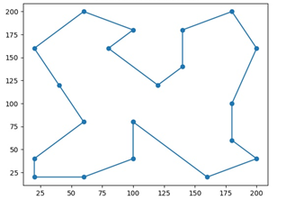

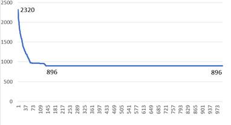

Všimnime si, že pri takejto menšej mape, keď sme spustili hľadanie na 1000 generácií, výsledok sme mali už po ~200 a zvyšné nepredstavovali žiadne vylepšenia, preto by bolo vhodné algoritmus ukončiť akonáhle po n generáciách nenájde vylepšenie.

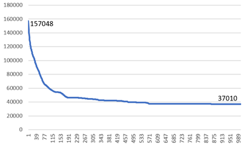

V prípade väčších máp, pokračuje zlepšovanie až do posledných 100 generácií 
Tu môžeme vidieť, že algoritmus začal na cene 
157 048 a podarilo sa mu vylepšiť túto cestu o ~424%. Čo predstavuje asi 10% chybovosť.
Ak by sme namiesto počtu iterácií nastavili stop podmienku natvrdo, na vypnutie po uplynutí x sekúnd, počet generácií by nás až tak nezaujímal a mohli by sme sledovať vývin najlepšej generácie bezohľadu na vylepšenie. Riešenie sa môže zlepšiť aj v poslednej sekunde hľadania a teda už nemusíme pokračovať ďalej, ale hľadanie vypneme. Táto skutočnosť nám pomôže regulovať náhodnosť pri testovaní, pretože všetky spustenia programu budú mať vyhradený rovnaký čas na nájdene výsledku. Ak sa algoritmus zasekne v lokálnom maxime tak mu to samozrejme nepomôže (rovnako pri menších mapách, ak nájde optimum), ale pri väčších, kde je potrebné preskúmať a vygenerovať viac susedov, dlhší čas evokuje vylepšenie úspešnosti.
|     Mapa         |     Výsledok    |     Posledné vylepšenie    |
|------------------|-----------------|----------------------------|
|     default20    |     896         |     0.15                   |
|     wi29         |     28470       |     0.28                   |
|     att48        |     34770       |     3.81                   |
|     berlin52     |     8493        |     3.54                   |

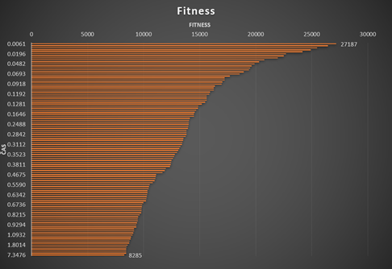

### Ukončovacia podmienka

Takýmto spôsobom by sme mohli pokračovať a zvyšovať ukončovaciu podmienku. Čím dlhší čas dáme algoritmom tým nájdu lepšie riešenie. Môžeme si všimnúť, že skoro všetky vylepšenia sa udiali takmer okamžite a posledné prišlo až po 5.5 sekundách bez vylepšenia. Toto potvrdzuje naše poslanie implementácie optimalizačných algoritmov a môžeme si všimnúť, že naozaj sa dokážu odtrhnúť od lokálneho maxima a pokračovať v hľadaní globálneho, ak im dáme dostatočne veľa času. Teraz môžeme vidieť, že podľa nami určenej očakávanej úspešnosti dokážeme korigovať a upravovať dĺžku vykonávania. Hodnota 8285 je približne 9% od optimálneho riešenia. 
Nakoľko chceme aby náš algoritmus bol, čo najpresnejší stanovme ukončovaciu podmienku pre VŠETKY algoritmy a ich parametre na max 15sekúnd. Skúmať budeme len väčšie mapy a to najčastejšie berlin52.
### Testovanie parametrov genetického algoritmu
Vráťme sa k parametrom tvorenia populácie v genetickom algoritme. Stanovili sme si veľkosť jednej generácie na 50, max počet krížení na 32, čo predstavuje 64% skrížených jedincov v novej generácií. Toto si môžeme predstaviť ako 60% šancu na skríženie. Podobne mutácia max. 14 jedincov - 28% z celku a so šancou 20%, čo celkovo predstavuje 5% zmutovaných potomkov. Na záver 8% novej krvi. Skúsme zmeniť tieto čísla a sledovať výsledky. Zachovajme popritom percentuálne rozloženie.

|     Parameter/ Veľkosť                     |     Malé    |     Stredné    |     Veľké    |     Obrovské    |
|--------------------------------------------|-------------|----------------|--------------|-----------------|
|     Veľkosť generácie                      |     20      |     50         |     100      |     500         |
|     Max. počet krížení                     |     12      |     32         |     64       |     320         |
|     Max. počet mutácií                     |     6       |     14         |     28       |     140         |
|     Max. náhodných jedincov v generácií    |     2       |     4          |     8        |     40          |
|     Pravdepodobnosť mutácie                |     20%     |     20%        |     20%      |     20%         |
|     Výsledok                               |     8274    |     8155       |     8097     |     8236        |

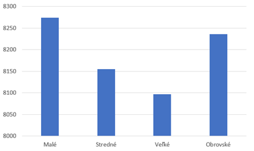

Veľká generácia v tomto teste zvíťazila, tesne za ňou je stredná a malá & obrovská sú v pozadí. Hlavnou zásluhou na tomto výsledku je doba hľadania, veľká generácia je vhodnejšia pre dlhšie hľadanie, nakoľko stihne spracovať veľký počet veľkých generácií.

### Výber rodiča
Ďalším parametrom je výber technika výberu rodiča, naimplementované sú tri, tak ich poďme porovnať uprednostnime strednú hodnotu z predchádzajúcich testov a využime stredné veľkosti generácií na mapách wi29 a att48.
|     Názov                                  |     wi29     |     att48    |     berlin52    |
|--------------------------------------------|--------------|--------------|-----------------|
|     Ruleta                                 |     28145    |     35932    |     8082        |
|     Rank   Selection                       |     29488    |     34740    |     8319        |
|     Turnaj                                 |     28900    |     37343    |     8804        |

Ruleta sa ukázala ako najlepšia metóda výberu rodiča. Pri väčšej mape s veľkými vzdialenosťami bola porazená podobnou rank technikou, kde bolo vhodné nevyberať na základe veľkých rozdielov vo fitness, ale v ich postavení. Turnaj ako ďalší element náhody neprispel pri ani jednej mape.

### Pravdepodobnosť mutácie

|     Pravdepodobnosť    |     wi29     |     att48    |     berlin52    |
|------------------------|--------------|--------------|-----------------|
|     0%                 |     34397    |     57447    |     13597       |
|     20%                |     28042    |     34866    |     8054        |
|     100%               |     30052    |     36851    |     8681        |

Bez operácie mutácia, riešenia veľmi rýchlo uviazli na lokálnom maxime a nepodarilo sa im z nich dostať. Ak sme do algoritmu pridali mutáciu výsledky sa začali zlepšovať, ale ak sme dali priveľkú, tak riešenie nadobudlo prvky náhodného skúšania rôznych permutácií. Môžeme si všimnúť, že aj keď mutácia bola nastavená na 100%, tak sa výsledky nelíšia o značnú hodnotu. V našom algoritme aj v prípade, že nastavíme mutáciu pre každý chromozóm, vytvorí sa nám len určité percento nových zmutovaných potomkov a celkovo to zásadne neovplyvní finálny výsledok.

### Simulované žíhanie

| Rýchlosť ochladenia | 0.00005   |
|---------------------|-----------|
| Minimálna teplota   | 1 * 10^-8 |
| Počiatočná teplota  | 1 * 10^-6 |

Na začiatok je potrebné povedať, že implementácia tohto riešenia sa môže líšiť od učebnicových pseudokódov, ale toto je jediný algoritmus, pomocou ktorého sa mi podarilo nájsť v rekordnom čase OPTIMÁLNE RIEŠENIE, ku všetkým 4 testovaným mapám!

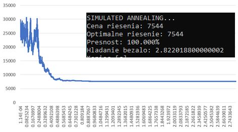

Krásne vidíme ako riešenie prekonáva lokálne extrémy, dáva priestor horším riešeniam až nájde globálne minimum. Tieto výsledky nie je možné prekonať pomocou akýchkoľvek iných parametrov v tejto implementácii. Výsledok bol už na svete po ~1 sekunde. Zaokrúhlené

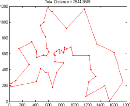

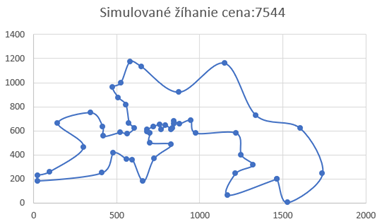

|     Mapa         |     Výsledok    |     Čas (sec)    |
|------------------|-----------------|------------------|
|     default20    |     896         |     1,35         |
|     wi29         |     27601       |     1.84         |
|     att48        |     33784       |     2.77         |
|     berlin52     |     7544        |     2.82         |

Priblížme si dopad zmien na výsledky riešenia.
Vysoká počiatočná teplota – akákoľvek hodnota od 1 po 50.. Dĺžka riešenia sa predĺži na približne 15 sekúnd a výsledok je ešte stále dobrý max ~5% chyba.

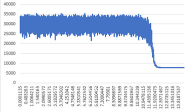

Riešenie dlhú dobu prekračuje okolo rovnako zlého bodu a nekonverguje k výsledku. Stále dookola sa akceptujú horšie riešenia a nedarí sa ho vylepšiť. Neskôr keď sa teplota ochladí na veľmi nízke hodnoty, riešenie sa výrazne zlepší.

Vysoká rýchlosť ochladenia – 0.05
Riešenie začne konvergovať, ale keďže chladíme priveľmi rýchlo nestihne sa dopracovať k lepším výsledkom, nestihne prezrieť viacero susedov a skončí veľmi rýchlo.
Tu je konkrétne vidieť, že vôbec nezáleží na tom akú počiatočnú teplotu zvolíme

Nízka rýchlosť ochladenia – 0.0000005 – Doba riešenia sa natiahne na neporovnateľnú časovú hodnotu oproti predchádzajúcim riešeniam. Explicitne sa hľadanie vyplo po 120 sekundách a vrátilo ~7548. Pričom minimálne minútu prešľapovalo na hodnotách od 7644-7900. Čo opäť len potvrdzuje funkčnosť optimalizačného algoritmu. Do textového súboru sa zapísalo 3.5M riadkov a bohužiaľ sa nedal vygenerovať ani graf.
Posledným parametrom je minimálna teplota. Na zvýšenie minimálnej teploty musíme zvýšiť aj maximálnu teplotu, klesanie nechajme rovnaké.

Riešenie vôbec nepripustí lepšie riešenia a ostane preskakovať na rovnakom  zlom lokálnom maxime.
Poznámka: Pokiaľ neudáme veľmi nízku hodnotu klesania teploty, vždy by sme mali nechať algoritmus dobehnúť pretože tie lepšie riešenia sa ukážu vždy až na konci

### Tabu Search
Posledným testovaným algoritmom bolo zakázané hľadanie. Paradoxne, vzhľadom na nízky počet parametrov, pri tomto poslednom riešení vznikalo najviac otáznikov ohľadne výberu metód a techník implementovaných pri generovaní resp. vyberaní susedov a celkovo k efektivite tohto algoritmu.
Jediným parametrom, okrem ukončovacej podmienky, je veľkosť tabu listu. Na dosiahnutie výsledkov porovnateľných s inými algoritmami udávajme ukončovaciu podmienku len na základe času vykonávania. Testy spúšťame vždy s maximálnou dĺžkou trvania rovnou 15s. 

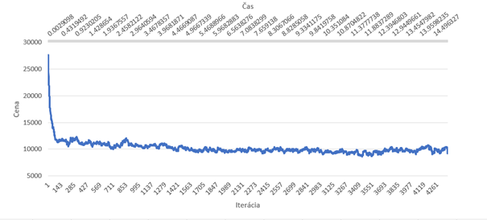

Riešenie rýchlo eliminuje tie najhoršie permutácie a postupne začne klesať. Skúša aj horšie možnosti, pretože postupne „zabúda“ na nájdené lokálne minimá a snaží sa od nich odlepiť. Ak sa pozrieme bližšie na tento graf, uvidíme, že každých 500 iterácií(veľkosť tabu listu) si algoritmus zvolí oveľa horšiu permutáciu. Taktiež do tretice aj pri tomto algoritme pozorujeme, fakt, že dokáže vylepšovať riešenia až do posledných sekúnd vykonávania. 
Jeden z príkladov postupného zabúdania, približne po 500 iteráciách sa vybrali horšie riešenia, ktoré sa potom optimalizovali smerom nadol. 
Za 15 sekúnd sa vygenerovalo približne 4300 iterácií, a pri 52 mestách, to je ~223 600 stavov.
Čím bude tabuľka väčšia tým dlhšie sa v nej bude hľadať a prestane byť účinná → riešenie spadne do lokálneho minima a nedokáže sa z neho dostať, nakoľko prehľadá len menšie množstvo stavov.

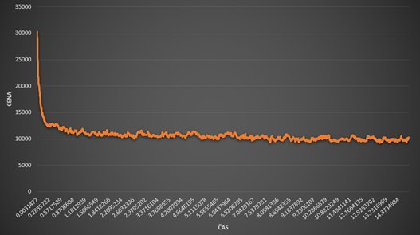

|     Veľkosť   Tabu Listu    |     Výsledok    |     Posledné   vylepšenie    |
|-----------------------------|-----------------|------------------------------|
|     50                      |     9125        |     11.58                    |
|     100                     |     8640        |     12.65                    |
|     500                     |     8411        |     13.94                    |
|     4500                    |     9625        |     9.20                     |

Obrovská veľkosť tabuľky smeruje k uviaznutiu v lokálnom extréme, a nižší počet navštívených stavov. Pri veľmi malých tabuľkách riešenie preskakuje medzi dvoma podobnými výsledkami. Zvoľme strednú veľkosť – 500 a vyskúšajme TABU na našich mapách

|     Veľkosť   Tabu Listu    |     Výsledok    |     Posledné   vylepšenie    |
|-----------------------------|-----------------|------------------------------|
|     50                      |     9125        |     11.58                    |
|     100                     |     8640        |     12.65                    |
|     500                     |     8411        |     13.94                    |
|     4500                    |     9625        |     9.20                     |

Celkovo všetky priemerné výsledky s veľkosťou tabu listu 100-1000 sú v vzdialenosti asi 15% od optimálneho riešenia. Čím dlhší čas dáme algoritmu tým nájde lepšie riešenie. Vidíme, že pre malé mapy aj keď po niekoľkých pokusoch, dokáže nájsť optimálne riešenie.
## Záver a zhodnotenie

V závere tejto práce dokážeme potvrdiť tvrdenia zo začiatku, nakoľko sa nám podarilo splniť cieľ projektu a teda naprogramovať funkčné optimalizačné algoritmy, ktoré dostanú na vstupe mapu miest a vrátia uspokojujúce riešenie v krátkom čase. Všetky algoritmy postupne vylepšujú doposiaľ nájdené riešenie a ak im je daný dosť veľký časový úsek, tým lepší bude výsledok. Správnou konfiguráciou a nastavením parametrov pre jednotlivé algoritmy sme zdokumentovali tvrdenie, že každý problém je unikátny a všetky metódy potrebujú prispôsobené parametre pre nájdenie, čo najlepšieho výsledku. 
Vykonanie celkového porovnania medzi uvedenými algoritmami je len ťažko možné odhadnúť, nakoľko všetky sú vhodné na iné požiadavky. Pomocou oficiálnych riešení sme porovnali výsledky a dospeli k záveru, že Simulované žíhanie svojou rýchlosťou a efektivitou vyniká na plnej čiare. Pokiaľ si zvolíme ako uspokojujúce riešenie, ktoré má chybovosť približne 10%, tak dokážeme využiť všetky algoritmy. Čím ideme nižšie tým viac času je potrebného na splnenie. Zložitosť riešenia sa odvíja aj od počtu miest na mape. Na veľkosti máp do 20 miest nám stačí maximálne 1-5 sekúnd, 50 miest - 15 sekúnd a takto to postupne stúpa, kde test s 200 mestami priniesol výsledok opäť s 10% chybou za 50-60 sekúnd. 
Štruktúra, parametre a  metódy algoritmov zapadajú do kompromisu medzi zložitosťou implementácie a efektivity. Môžeme prehlásiť, že sa nám podarilo vykonať porovnania medzi parametrami algoritmov, vizualizovať výsledky a vývoj riešenia do grafov a tabuliek. Cesta k zložitejším riešeniam v ďalšom pokračovaní tohto alebo iného predmetu, či v praxi je otvorená.

Zdroje:  
[1] – Euclidian Distance  
http://rosalind.info/glossary/euclidean-distance/  
[2] – TSPLIB a Rounding   
http://comopt.ifi.uni-heidelberg.de/software/TSPLIB95/TSPFAQ.html  
[3] - Kolahan, Farhad & TAVAKOLI, AHMAD & TAJDIN, BEHRANG & HOSAYNI, MODJTABA. (2006). Analysis of neighborhood generation and move selection strategies on the performance of Tabu Search.  
https://www.researchgate.net/publication/255599657_Analysis_of_neighborhood_generation_and_move_selection_strategies_on_the_performance_of_Tabu_Search  
[4] – National Traveling Salesman Problem Datasets http://www.math.uwaterloo.ca/tsp/world/countries.html  
[5] – Burkardt, John. Department of Scientific Computing, Florida State University. TSP Data sets. https://people.sc.fsu.edu/~jburkardt/datasets/tsp/tsp.html   
[6] - Otman, Abdoun & Tajani, Chakir & Abouchabka, Jaafar. (2012).Application to Travelling Salesman Problem. International Journal of Computer Science Issues. 9.  
https://www.researchgate.net/figure/The-optimal-solution-of-Berlin52_fig2_221901574  
Kreslenie diagramov – draw.io   
