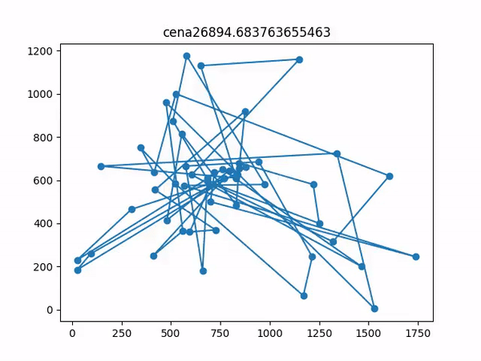
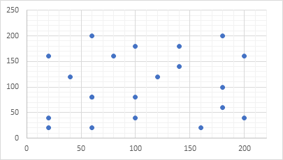
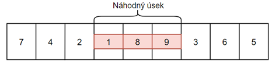
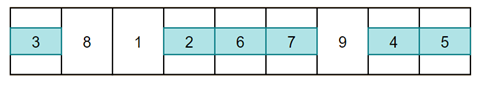
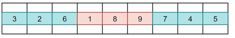
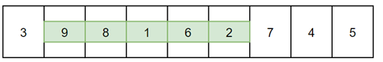

# Ukážka



# Problém obchodného cestujúceho

## Úvod

Zadaním tohto projektu je implementovať rôzne optimalizačné algoritmy, ktoré nám umožnia nájsť dostatočne dobrú permutáciu navštívenia všetkých zadaných miest na vstupe. Cieľom je navštíviť všetky mestá iba raz a nakoniec sa vrátiť do mesta, z ktorého vychádza. Pomocou algoritmov určených na hľadanie tejto cesty sa snažíme nájsť najkratšiu možnú uzavretú krivku, po ktorej by obchodný cestujúci mohol ísť. Počas vývoja algoritmov, taktiež porovnávame využité súčasti a techniky potrebné na správne fungovanie a vrátenie výsledku. Výsledok bude pozostávať z jednotlivých navštívených miest a finálnej sume vzdialeností.

Hlavnou podstatou tejto práce je implementácia nasledujúcich algoritmov:

- Genetický algoritmus → **GA**
- Simulované žíhanie → **SA**
- Zakázané prehľadávanie → **TABU**

Program sa skladá z mainu, kde sa spúšťa a číta na vstupe zadanú mapu zo súboru. Následne volá podľa zadania používateľa jednotlivé algoritmy a vypisuje riešenie.

1. Načítanie vstupu a výber algoritmu
2. Hľadanie cesty
3. Výpis riešenia

## Implementačné prostredie

Program predstavuje konzolovú aplikáciu, ktorá bola vytvorená v programovacom jazyku **Python v3.8.5 64bit**. Spúšťa sa cez Command Line, PowerShell alebo iný CLI nástroj. Počas celého vykonania programu používame nasledujúce importované moduly:

- [random](https://docs.python.org/3/library/random.html)
    - Náhodné generovanie celého alebo desatinného čísla z rozsahu
- [timeit](https://docs.python.org/2/library/timeit.html)
    - Meranie času vykonávania algoritmov
- [math](https://docs.python.org/3/library/math.html)
    - matematické funkcie pre simulované žíhanie
- [futures](https://docs.python.org/3/library/concurrent.futures.html)
    - multiprocessing na spúšťanie všetkých algoritmov naraz.

Vlastné moduly;

- utils
    - čítanie vstupu, reprezentácia mesta, výpočet fitness a výpis riešenia

## Reprezentácia údajov

Všetky mestá majú svoje súradnice v 2D priestore. Vstupná mapa a rozloženie miest je načítaná zo vstupného súboru na začiatku. Použijeme jednoduchú triedu City, ktorá má dve atribúty a to x a y.



Všetky algoritmy používajú na svoju realizáciu jednotlivé funkcie a atribúty, ktorých fungovanie si vysvetlíme pri každom zvlášť. Skoro pri všetkých je použitá určitá trieda na reprezentovanie jednej permutácie miest.

Genetický algoritmus, - trieda Jedinec.

Simulované žíhanie, - trieda Stav.

Takéto rozdelenie je hlavne kvôli tomu, že ku každej permutácií prislúcha jej cena, čiže vzdialenosť od začiatku do konca. Pri týchto dvoch algoritmoch sa oplatí vykonať tento výpočet okamžite – pri vygenerovaní nového stavu. Pri Tabu Search to nie je potrebné a počítame cenu, až keď potrebujeme.

## Výpočet ceny – vzdialenosti – fitness

Cena cesty medzi dvoma mestami prislúcha Euklidovej vzdialenosti

Počítame ju pomocou vzorca 

```python
sqrt(pow(x2-x1),pow(y2-y1)
```

kde x a y sú súradnice miest. Z *utils* funkcia 

```python
euclidian_d(a, b) *returns* distance : float
```

Túto funkciu voláme, pre každé dve mestá v permutácií a celkovú fitness vypočíta funkcia

```python
fitness(stav) returns cena : round(int)
```

Tento výsledok na základe všeobecnej normy[2] zaokrúhľujeme k najbližšiemu celému číslu.

Keďže hľadáme najkratšiu cestu, tak pre logické fungovanie a prehľadnosť, je vhodné udržiavať si

**prevrátenú hodnotu** dĺžky celej cesty. Inak povedané, ak výsledok z funkcii vyššie umocníme na mínus  dostaneme číslo, ktoré je čím vyššie, tým lepšie *1/cena* a teda lacnejšia cena.

## Metódy a opis použitých algoritmov

Aplikovali sme tri rôzne **optimalizačné algoritmy** na hľadanie, čo najkratšej cesty. Všetky algoritmy sú reprezentované ako samostatné triedy so svojimi metódami a atribútmi. Na to aby sme mohli, z každého z nich vrátiť riešenie ako postupnosť krokov a uchovať potrebné dáta pre výpis, dedia od nadradeného objektu List. Vstupom do týchto algoritmov sú konkrétne **parametre**, ktoré úzko súvisia s riešeným problémom a častokrát sa môžu prispôsobiť pri zmene počtu miest alebo ich rozloženiu.

Algoritmy sa môžu vykonávať neobmedzene dlho, preto je potrebné si zadefinovať **vypínaciu podmienku**. Jedna možnosť je počet iterácií alebo druhá, dĺžka vykonávania. V našom programe je táto podmienka súčasťou spoločných parametrov pre všetky algoritmy.

### Genetický algoritmus

Genetický algoritmu sa snaží priblížiť podobe evolučného vývinu a používa proces naturálnej selekcie na prežitie najlepších jedincov. Spolieha sa biologicky inšpirované operácie ako mutácia, kríženie.

**Gény** sú mestá na mape.

**Chromozóm** teda Jedinec je jedna permutácia miest so svojou fitness.

Hlavná myšlienka a pseudo blokový návrh:

1. Inicializácia prvej generácie
2. Kríženie
3. Mutácia
4. Nová krv
5. Prirodzený výber
6. Opakuj od kroku 2.

Parametre pre GA:

- Veľkosť Generácie
- Počet krížení
- Maximálny počet mutácií
- Veľkosť náhodnej novej krvi vloženej do populácie
- Pravdepodobnosť mutácie
- Metóda výberu rodičov

### Inicializácia prvej a tvorba novej generácie

**Prvá generácia**

Pozostáva z vygenerovania náhodnej permutácie miest. Funkcia dostane žiadanú veľkosť na vstupe a vráti prvú generáciu, ktorú zoradíme zostupne.

```python
random_generacia(cities, velkost)	*returns* generacia : List.
```

Nasledujú biologické operácie, ktoré vykonávame nad každou generáciou. Tieto operácie sú reprezentované vlastnou triedou, ktorá opäť dedí od List a má svoje metódy a parametre.

### Kríženie a výber rodičov

Kríženie slúži na kombináciu čiastočných riešení na rôznych chromozómoch. Pomocou metód výberu vyberáme rodičov, ktorých, keď skrížime vznikne dieťa s črtami rodičov.

```python
Krizenie(generacia, velkost, metoda_vyberu_rodica) *returns* skrizeni_potomkovia : List
```

Metódy výberu rodičov – vždy vyberáme **dvoch** rodičov, ktorých skrížime.

- **Ruleta**
    - Výber sa vykoná na základe fitness.
    - Každý chromozóm dostane vyhradený segment na kolese rulety.
    - Čím väčšia fitness tým väčší segment.
    - Náhodný dopad guličky vypovedá o vybratom rodičovi.
    - Sčítame celkovú fitness generácie a hodíme guličkou. Následne sčítavame fitness jedincov a ak prekročí medzisúčet náhodnú hodnotu, tak vyberieme jedinca, na ktorom práve sme.
    - Lepší jedinci majú vyššiu šancu byť vybratý.
- **Rank Selection**
    - Rovnako ako v rulete vyberáme na základe fitness.
    - Segmenty sú rozdelené úmerne poradiu chromozómov.
    - Súčet v tomto prípade predstavuje (*n*(n+1))/2*
    - Medzisúčet: *poradie_jedinca / súčet*
    - Ak prekročíme náhodný hod v rozmedzí , tak vyberieme jedinca, na ktorom práve sme.
    - Lepší jedinci majú vyššiu šancu byť vybratý a ak sú hodnoty fittness veľmi podobné, neuprednostňujeme tých jedincov, ktorý sú oveľa lepší.
- **Turnaj**
    - Náhodne vyberieme dvoch jedincov v generácií a z nich toho lepšieho.
    - Vyššia šanca vybrať horšieho jedinca

    Poznámka: To, že skrížime dvoch rodičov, neznamená, že zaniknú.

    Keď máme vybratých rodičov, môžeme započať **dvojbodové kríženie**. Z prvého rodiča, vyberieme náhodný úsek a vložíme ho na miesto v dieťati. Z druhého rodiča vyplníme chýbajúce miesta, tak aby neboli v permutácií duplikáty.

    

    

    

    Takýmto spôsobom vygenerujeme určité percento potomkov, ktoré vložíme do novej generácie.

    ### Mutácia

    Akonáhle máme vygenerovaných potomkov rodičov, ďalšia časť generácie bude tvorená mutáciou potomkov. Deti mutujeme len s určitou pravdepodobnosťou na mutáciu, ktorá je parametrom algoritmu. Nemala by byť veľmi vysoká ani nízka.

    ```python
    Mutacia(generacia, velkost, mutacia_probability) *returns* zmutovani_potomkovia : List
    ```

    Mutácia prebieha náhodným výberom jedného potomka a otočením úseku náhodnej dĺžky v ňom. Z obrázku 5 vezmime toto dieťa, po výbere úseku indexov 1 až 5(mutácií) vznikne:

    

    Zmutovaní potomkovia tvoria určité percento v novej generácií.

    **Nová krv**

    Do každej novej generácie zavedieme aj čisto nové čisto náhodné permutácie, aby sme primiešali medzi cenovo podobné jedince niekoľko nových.

    **Prirodzený výber**

    Pod pojmom **natural selection** budeme rozumieť prežitie len tých najlepších jedincov z generácie. V našom algoritme vygenerujeme maximálne dvojnásobok nových jedincov ako sme už mali v predchádzajúcej generácií. Usporiadaním zostupne podľa fitness prežije celkovo len jedna polovica, ktorú posunieme do ďalšej generácie.

    Týmto spôsobom zabezpečíme určitý počet najlepších jedincov z predch. generácie (elitárstvo) a prísun nových silnejších jedincov.

    Proces opakujeme, pokým sa nesplní podmienka na zastavenie a následne vrátime najlepšieho jedinca z poslednej generácie.

    **Simulované žíhanie**

    Podobne ako genetický algoritmus, simulované žíhanie sa snaží priblížiť určitému **prírodnému javu** – technike zahrňujúcu oteplenie a kontrolované chladenie materiálu na zníženie chýb alebo vád.

    Dôležitým prvkom v tomto algoritme je definícia **rozvrhu zmeny teploty**. Trieda Rozvrh riadi počiatočnú teplotu, minimálnu teplotu a postupne ochladzovanie. V počiatku vykonávania algoritmu vykonávane veľké zmeny k horšiemu, na to aby sme sa dostali z lokálneho minima. Čím je teplota vyššia, tým sa vykonávajú väčšie zmeny. Na rozdiel od GA pracujeme naraz iba s dvoma riešeniami, stav, ktorý máme práve uložený a jedno susedné riešenie. Eventuálne, keď je teplota dosť nízka začnú sa vyberať už len lepšie riešenia ako doposiaľ nájdené.

    Parametre pre SA:

    - Počiatočná teplota
    - Minimálna teplota
    - Rýchlosť ochladenia

    Jedna unikátna permutácia – riešenie,  je reprezentované triedou Stav so svojou fitness.

    Na začiatku algoritmu vyberieme náhodnú permutáciu, ktorú označíme ako current (práve skúmanú) a nájdeme mu suseda.

    **Výber nasledovníka**

    Existuje veľké množstvo možností výberu susedného mesta, v tomto projekte sa používa výber a otočenie náhodného úseku v terajšom stave – podobne ako pri GA mutáciách. Funkcia vracia iba jedného suseda.

    ```python
    vyber_nasledovnika(stav) *returns* susedny_stav : Stav(List)
    ```

    **Zámena s doposiaľ nájdeným riešením**

    Ďalším krokom je vypočítať tzv. deltu, ktorá nám napovie o rozdiele cien týchto dvoch stavov. Ak je vyššia než 0, teda sused má lepšiu fitness ako predchádzajúci stav zmena nastane vždy. V opačnom prípade je to horšie riešenie a zmena nemu sa vykoná len na základe určitej pravdepodobnosti. Vygenerujeme náhodné číslo v intervale (0,1), a ak spadá do akceptačnej probability tak sa vyberie. Táto akceptačná probabilita vychádza z exponenciálnej funkcie, ktorej parameter je podiel rozdielu fitness práve skúmaných miest a terajšej teploty.

    Po nahradení alebo nenahradení stavov, **znížime teplotu**. Táto teplota sa mení percentuálne podľa parametrov. Ak by bola teplota 35° a rýchlosť ochladenia 0.005, tak výpočet je nasledujúci:  , čiže  , a teda sme ochladili o  .

    Tento proces opakujeme až do uplynutia vypínacej podmienky, resp. do zníženia teploty pod minimálnu. Na konci vrátime posledný skúmaný stav.

    ## Zakázané prehľadávanie – Tabu Search

    Zakázané prehľadávanie je ďalším optimalizačným algoritmom, ktorý sa snaží nájsť dostatočne dobré riešenie a pri tom sa nezaseknúť v lokálnom minime. Pri hľadaní používa **tabu tabuľku**, do ktorej si ukladá malé množstvo posledne navštívených stavov. Pomocou tabuľky je možné vybrať horšie riešenie a preskúmať aj iné za cieľom ďalšej optimalizácie. Tabu hľadanie neobsahuje konkrétnu triedu, ktorá reprezentuje jednu permutáciu nakoľko si ukladá jedno doposiaľ nájdené maximum a počíta fitness(cenu), len keď je to potrebné.

    Parametre pre TABU:

    - Maximálny Počet nevylepšení maxima
    - Veľkosť tabu listu

    Všimnime si, že namiesto počtu iterácií používame počet vygenerovaných susedov, ktorý neboli lepší ako doposiaľ nájdené maximum.

    Na začiatku algoritmu vygenerujeme náhodnú permutáciu (**vektor**) a vložíme ho do tabu listu. Následne generujeme nasledovníkov.

    **Generovanie nasledovníkov**

    Rovnako ako pri SA je možností ako generovať nasledovníkov viacero[3]. Ak by sme generovali veľké množstvo – prehadzovanie všetkých susedných miest navzájom každý stav, by bol schopný vygenerovať (n nad 2) susedov a toto by zabralo veľké množstvo času. Preto v tomto projekte je použitá nasledovná metóda

    ```python
    vygeneruj_nasledovnikov(stav)	*returns* nasledovnici : List
    ```

    V tejto funkcii si zvolíme náhodné mesto z terajšieho najlepšieho stavu. Toto mesto povymieňame so všetkými ostatnými mestami vo vektore, čím dostaneme maximálne n nasledovníkov. Následne musíme nájsť najlepšieho kandidáta.

    **Výber najlepšieho kandidáta**

    ```python
    najdi_najlepsieho_kandidata(nasledovnici, tabu_list) *returns* kandidat : List
    ```

    Vráti jedného kandidáta, ktorého nájdeme využitím tabu listu. Na začiatku prvý stav zo zoznamu nasledovníkov označíme ako potenciálneho kandidáta. V tabu liste postupne hľadáme všetkých vygenerovaných nasledovníkov. Ak sa tam nasledovník nenachádza a jeho fitness je lepšia ako doposiaľ nájdená fitness kandidáta, označíme ho ako nového kandidáta. Proces opakujeme pokým nepreskúmame všetkých. V hlavnom cykle porovnáme fitness tohto najlepšieho kandidáta s doposiaľ nájdeným globálnym maximom a ak je menšie, našli sme nové prechodné maximum. Taktiež môžeme resetnut počítadlo nevylepšení, lebo sa nám to práve podarilo.

    **Veľkosť tabu listu**

    Veľkosť tabu listu prispôsobujeme na základe problému a jeho veľkosť sa môže meniť s počtom miest. Ak sa zoznam naplní, postupne odstraňujeme najstaršie riešenia, ktoré sa nachádzajú na jeho začiatku. Vďaka tejto povinnosti nie je možné ho reprezentovať ako hash tabuľku, v ktorej by sa dalo efektívne vyhľadávať, nakoľko ho potrebujeme mať indexovaný – usporiadaný od najstaršieho. Odstránenie najstaršieho vykonáme pomocou metódy tabu_list.pop(0).

    Tento proces opakujeme až do splnenia podmienky zastavenia a na konci vrátime doposiaľ nájdené minimum.

    ### **Možné optimalizácie**

    Všetky optimalizačné algoritmy fungujú najlepšie, keď sú špecificky prispôsobené problému, ktorý riešia. V našom prípade vnútorné technické funkcie ako napríklad výber susedných stavov v tabu search alebo metóda mutácie a kríženia v GA sa dajú dolaďovať aj na základe počtu uvedených miest na vstupe, ich vzdialenostiam atď. Existujú rôzne metódy, ktoré sú skúmané a vyhodnocované na väčšej vzorke údajov a na koniec je vybratá tá najlepšia. V rozsahu a škále tohto zadania sa zvolili určité metódy, ktoré predstavujú kompromis medzi zložitosťou implementácie a ich efektivitou.

    ### Používateľské rozhranie

    Ovládanie programu spočíva v interaktívnom režime, konkrétne odpovedáme na výzvy programu, pomocou klávesnice píšeme vstup a na obrazovke sa objavuje výstup, poprípade môžeme presmerovať výstup do súboru.

    **Upozornenie:**

    **Program obsahuje veľké množstvo parametrov pre algoritmy a preto je potrebné ich manuálne nastaviť v súbore main.py editáciou polí určených na to.**

    Hlavný cyklus interaktivity spočíva vo výbere mapy a algoritmu:

    1. Výber mapy

        Výber predvygenerovaného:

        default20 – 20 miest zo zadania

        wi29 – Western Sahara 29 miest

        att48 – Hlavné mestá štátov v USA vnútrozemí – 48 miest

        berlin52 – Klasický problém – 52 miest

        Vlastný vstup zo súboru vlastny.txt

    2. Výber algoritmu
        1. jednotlivé
        2. všetky naraz pomocou multiprocessingu(pre plynulejší priebeh je vhodné aby CPU malo aspoň 3 vlákna)
    3. Výpis riešenia

    **Predvygenerované mapy sa nachádzajú v priečinku tests\\{názov} Vlastnú mapu je možné doplniť do vstup.txt v tests.**

    ## Testovanie

    Na úvod je vhodné povedať, že aj mapy rovnakej veľkosti s rovnakým rozmiestnením miest vo väčšine prípadov vrátia rôzne výsledky, ak zopakujeme vykonanie rovnaké algoritmu. Tento fakt nie je nijak prekvapivý, nakoľko vo všetkých algoritmoch je vsadená určitá vzorka cielenej informovanej náhody. Všade je prítomná a vždy ovplyvňuje výsledky testov. Občas sa stane, že výsledok je o niekoľko percent lepší resp. horší ako predchádzajúci rovnaký test. Nedávno sa k tejto téme vyjadril kolega z FIIT na diskusnom fóre Askalot a zhrnul to lepšie ako to dokážem ja a preto odkážem len na jeho príspevok.

    Testovací hardware: Windows 10 Home 64bit, i7-7700K @ 4.20GHz, 16GB RAM. Python 3.8.5 64bit.
